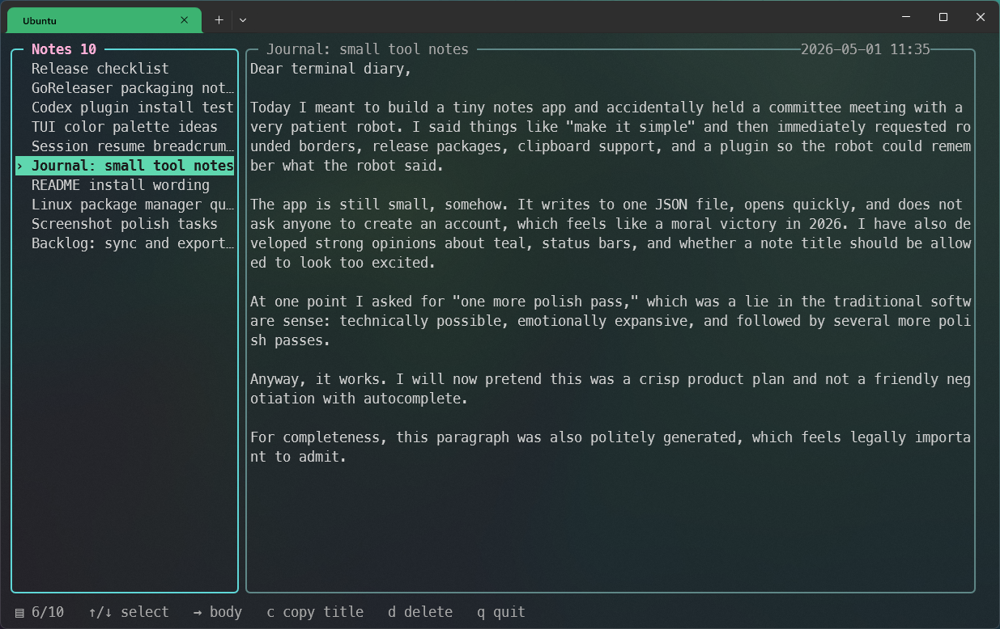

# lazynote

[](https://github.com/rschoch/lazynote/actions/workflows/ci.yml)
[](https://github.com/rschoch/lazynote/releases)
[](https://goreportcard.com/report/github.com/rschoch/lazynote)
[](https://github.com/rschoch/lazynote/releases/latest)

`lazynote` is a local, terminal-first notes app for developer workflows.

Take notes instantly from the CLI, browse them in a small TUI, and expose the
same notes to shell scripts, terminal tools, and coding agents. It is built for
quick context capture without an account, server, database, or sync service.

Notes are stored locally as JSON. The released binary does not require a Go
toolchain.

## Why lazynote?

- Capture notes from arguments, stdin, and shell pipelines.
- Retrieve context with plain commands such as `list`, `show`, `search`, and
  `export`.
- Share one local notes file between humans, scripts, and coding agents.
- Browse notes in a fast terminal UI when you want a human view.

## Quick Example

```sh
# take simple note: $ lazynote <title> <body>
lazynote showerthought 'Running from the cops is the ultimate double or nothing.'

# piped body with an inferred title
printf '## Session abc123\n- fixed flaky test\n' | lazynote

# retrieve context
lazynote list
lazynote search flaky
lazynote export json
```



## Install

Recommended for Linux and macOS:

```sh
curl -fsSL https://raw.githubusercontent.com/rschoch/lazynote/main/install.sh | sh
```

The installer downloads the latest release, verifies checksums when possible,
and installs `lazynote` to `~/.local/bin`.

If your shell cannot find it:

```sh
export PATH="$HOME/.local/bin:$PATH"
```

Inspect the installer first:

```sh
curl -fsSLO https://raw.githubusercontent.com/rschoch/lazynote/main/install.sh
sh install.sh
```

Installer options:

```sh
sh install.sh --dir /usr/local/bin
sh install.sh --version vX.Y.Z
```

Uninstall a script-installed binary:

```sh
rm -f ~/.local/bin/lazynote
```

Prebuilt archives and Linux `.deb`, `.rpm`, and `.apk` packages are available on
the [GitHub Releases](https://github.com/rschoch/lazynote/releases) page. Direct
downloads do not add an apt/yum/apk repository, so package-manager auto-updates
are not configured yet.

From source:

```sh
go install github.com/rschoch/lazynote/cmd/lazynote@latest
```

From a checkout:

```sh
make build
make install
```

`make install` uses `/usr/local` by default. Use `PREFIX` for another root:

```sh
make install PREFIX="$HOME/.local"
```

## CLI Workflows

Capture a note:

```sh
lazynote idea 'Use a single notes file so agents and humans share context.'
```

Capture from stdin:

```sh
echo 'Refactor release notes before tagging the next release.' | lazynote release
cat summary.md | lazynote 'session summary'
lazynote 'session summary' - < summary.md
```

If stdin is piped without a title, the first non-empty line becomes the title:

```sh
printf '## Session abc123\n- shipped release prep\n' | lazynote
```

Suppress success output for scripts and agents:

```sh
some-command | lazynote --quiet 'session summary'
lazynote --quiet release 'Tag after CI passes.'
```

Retrieve context:

```sh
lazynote list
lazynote show <id>
lazynote show --body <id>
lazynote search packaging
lazynote export markdown
lazynote export json
lazynote path
```

`list` prints tab-separated `id`, `created_at`, and `title` fields. `show`
accepts a full ID or a unique ID prefix.

Command words such as `list`, `show`, `search`, `path`, and `export` are
reserved when they are the first argument. Use `--` to use one as a title:

```sh
lazynote -- search 'a note whose title is search'
```

Use single quotes for literal shell text, especially if the note contains
characters like `!`, `$`, or backticks.

## Agent Plugins

Agent plugins are optional. The `lazynote` CLI works on its own; plugins only
teach tools like Codex or Claude Code how to save and retrieve notes through the
CLI. Install the `lazynote` binary first, then install the plugin for your
agent.

Codex, tested locally:

```sh
codex plugin marketplace add rschoch/lazynote
```

Then open `/plugins` in Codex and install `lazynote`.

Claude Code, plugin layout provided but not yet verified by this project:

```text
/plugin marketplace add rschoch/lazynote
/plugin install lazynote@lazynote
/reload-plugins
```

Once the `lazynote` plugin is installed, you can ask an agent to persist or
retrieve project context:

```text
Use lazynote to save the proposed implementation plan.
Search lazynote for notes about release packaging.
Save a summary of this debugging session to lazynote.
```

## TUI

Open the terminal UI:

```sh
lazynote
```

The TUI shows note titles on the left and the selected note body on the right.
The bottom status line shows context-specific key hints.

Keys:

- left: focus note list
- right: focus note body
- down: move or scroll down in the active pane
- up: move or scroll up in the active pane
- PageDown: scroll note body down
- PageUp: scroll note body up
- `c`: copy the selected title or note body
- `d` / delete: arm deletion; press `d` again to confirm
- `q` / Ctrl-C: quit

Copy uses terminal clipboard support. Fonts, glyph rendering, and colors depend
on your terminal emulator.

### Themes

The TUI includes `default`, `mono`, and `high-contrast` themes:

```sh
LAZYNOTE_THEME=mono lazynote
```

Custom theme overrides are configured in `~/.config/lazynote/config.json`.
See [THEMING.md](THEMING.md) for the full format and examples.

## Storage

Default notes file:

```text
~/.local/share/lazynote/notes.json
```

Print the active path:

```sh
lazynote path
```

Use a different notes file:

```sh
LAZYNOTE_PATH=/tmp/lazynote-dev.json lazynote list
```

Back up your notes:

```sh
mkdir -p ~/backup/lazynote
cp "$(lazynote path)" ~/backup/lazynote/notes.json
```

Because storage is one JSON file, it can be synced with tools like Syncthing,
Dropbox, iCloud Drive, or a private dotfiles repository. Stop `lazynote` before
replacing the file manually.

## Development

Run tests and build a dev binary:

```sh
make test
make build
bin/lazynote --version
```

Try the dev binary without touching your real notes:

```sh
LAZYNOTE_PATH=/tmp/lazynote-dev.json bin/lazynote 'dev smoke' 'hello from local build'
LAZYNOTE_PATH=/tmp/lazynote-dev.json bin/lazynote list
LAZYNOTE_PATH=/tmp/lazynote-dev.json bin/lazynote export markdown
LAZYNOTE_PATH=/tmp/lazynote-dev.json bin/lazynote
```

If `go` is installed but not on `PATH`:

```sh
make GO=/usr/local/go/bin/go test
make GO=/usr/local/go/bin/go build
```

Check the installer script:

```sh
sh -n install.sh
sh install.sh --help
```

Useful targets:

- `make build`: build `bin/lazynote`
- `make test`: run `go test ./...`
- `make install`: install under `$(PREFIX)/bin`
- `make uninstall`: remove from `$(PREFIX)/bin`
- `make clean`: remove local build and release artifacts
- `make release-snapshot`: build local GoReleaser artifacts

## Releases

GoReleaser configuration lives in `.goreleaser.yaml`. Tagged releases build
Linux, macOS, and Windows binaries for `amd64` and `arm64`, plus checksums,
archives, and Linux packages.

Create a local snapshot:

```sh
make release-snapshot
```

Publish a tagged release:

```sh
git tag vX.Y.Z
git push origin vX.Y.Z
```

GitHub Actions runs tests and publishes release artifacts. Publishing apt/yum/apk
repositories or Homebrew taps is a separate distribution step.

## License

MIT
